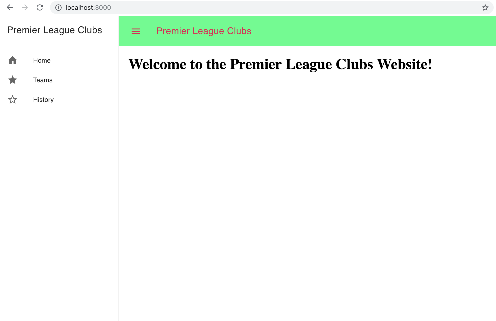
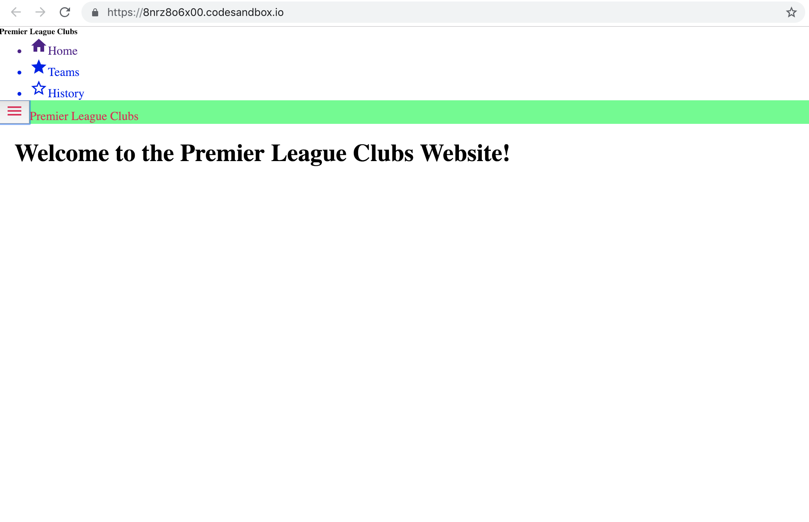

# Simple React-Router-v4 app made with MDC boilerplate

## You can see the demo [here](https://codesandbox.io/s/8nrz8o6x00).

This is a simple application built using React-Router-v4 and all of the source is present above.
This application was bootstrapped with ```create-react-app```

Material-Design-Components for react can be found [here](https://github.com/material-components/material-components-web-react)

Just clone the repo.

To see the output. You can follow the steps down below.

```text
cd simple-react-router-v4-mdc

// depending on what you use. npm / yarn
yarn install or npm install

// once this is done. to run the application. type...
yarn start or npm start
```

#### ⚠ Warning: The above link for the demo of the Simple React Router v4 Component with MDC has some errors currently. I'd please request you to clone, install dependencies and then see the output on your system.

### The following information is regarding the [issue](https://github.com/Kolhar730/react-router-v4-simple-and-mdc/issues/2)

This is how it is supposed to be: (this is on my local system)



This is how it currently is: (when the current sour)



Any queries / suggestions can be put up in the issues section.

Danke.